# Architecture

This document describes the internal architecture of `req`, including data flow, component interactions, and system design.

## Overview

`req` is structured as a pipeline: **Parse → Plan → Execute → Output**

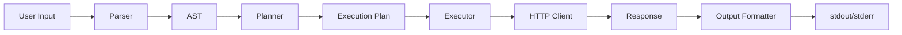

## Component Architecture

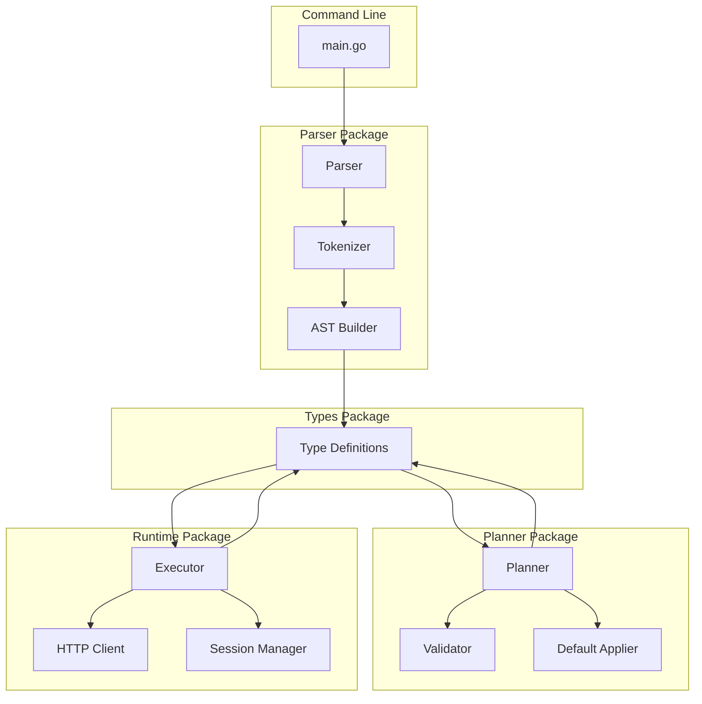

## Request Lifecycle

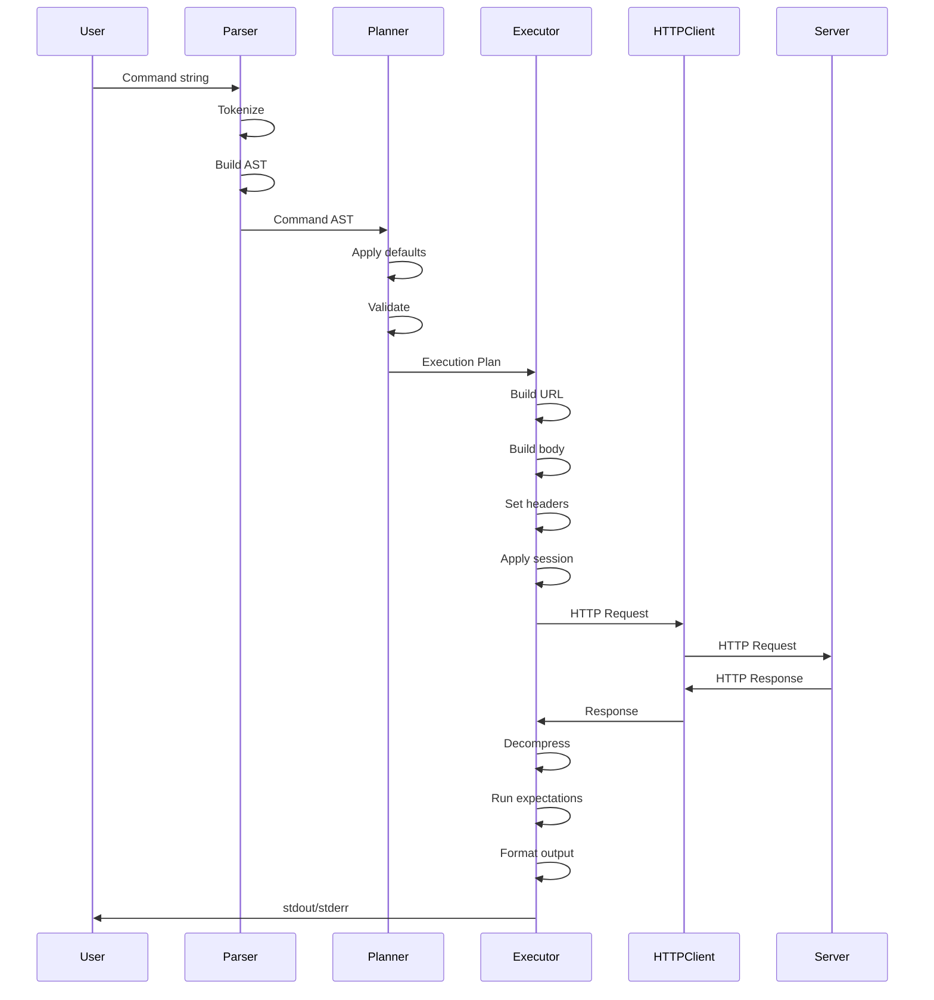

## Parser Architecture

The parser uses a two-phase approach: tokenization followed by parsing.

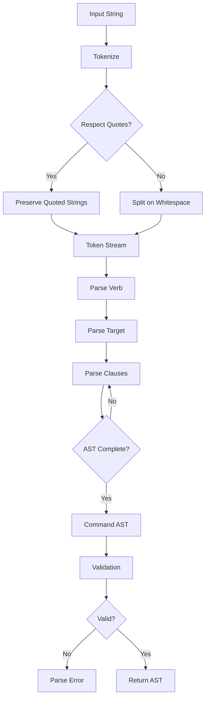

### Tokenization Flow

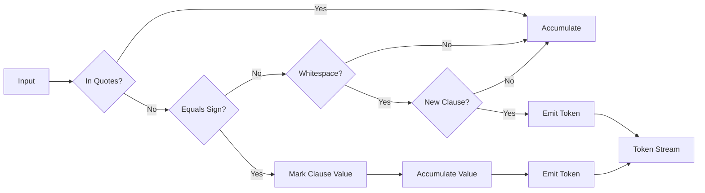

## Execution Flow

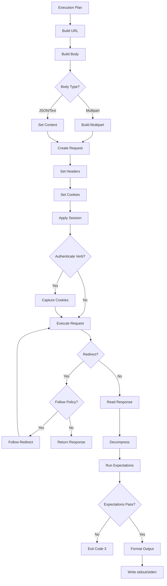

## Session Management Flow

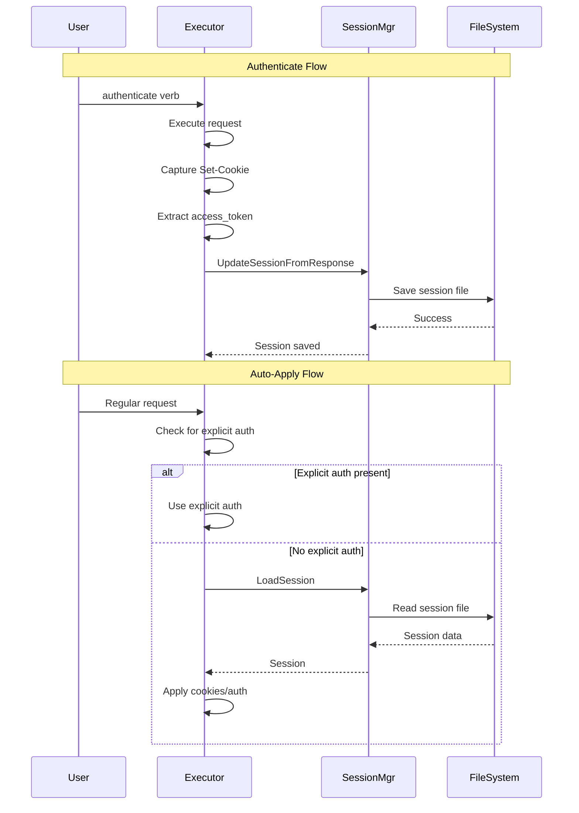

## Redirect Handling

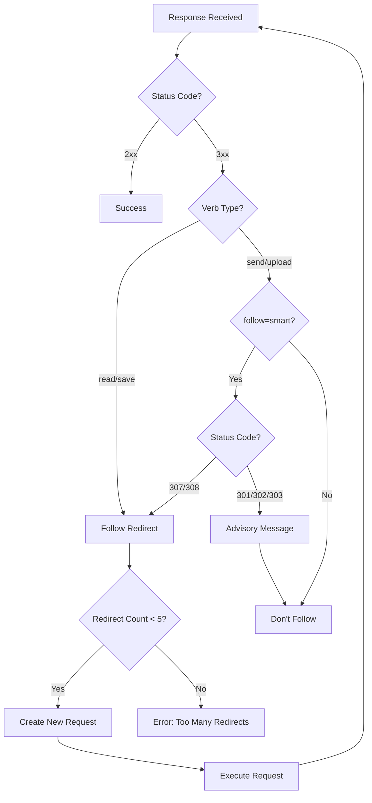

## Error Handling Flow

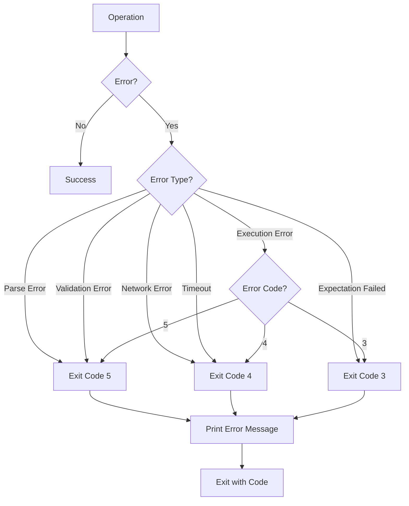

## Include Clause Processing

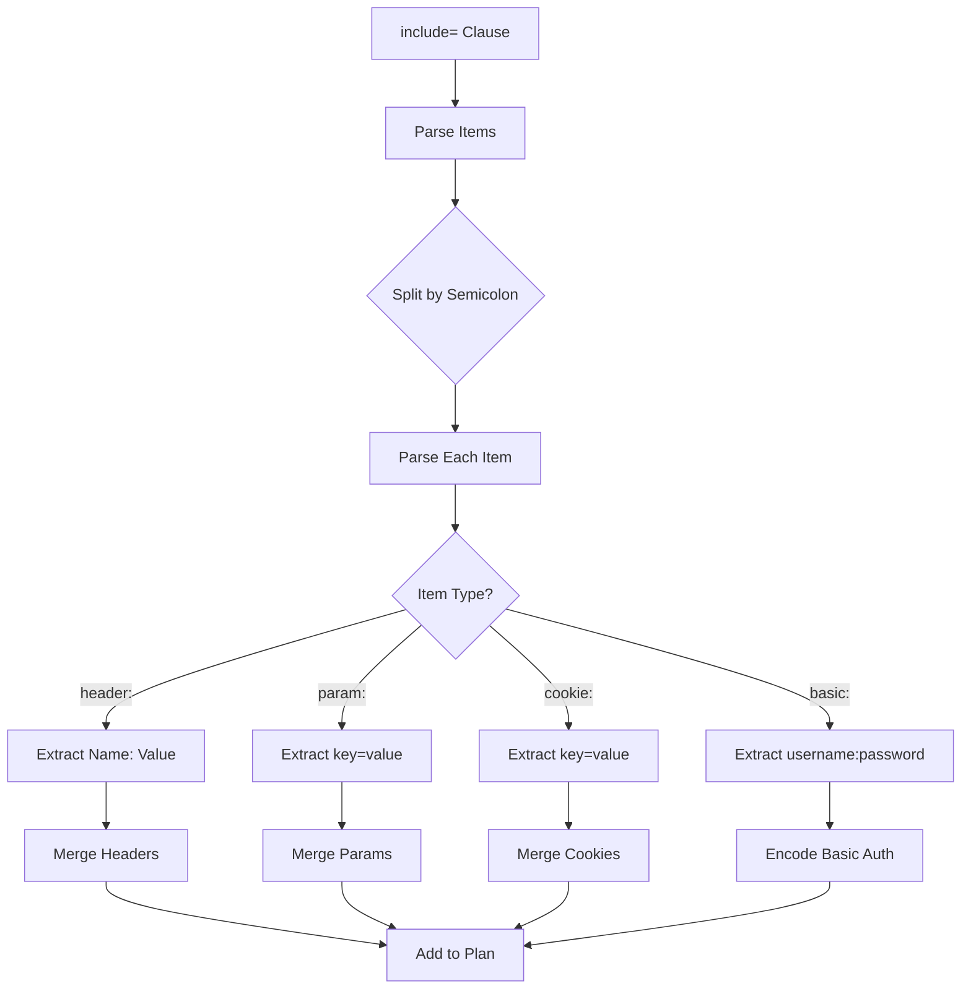

## Data Structures

### Command AST

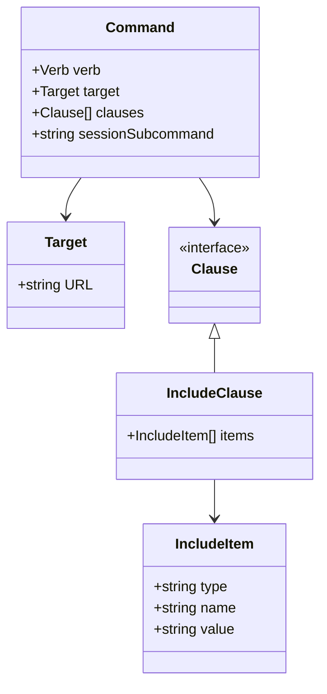

### Execution Plan

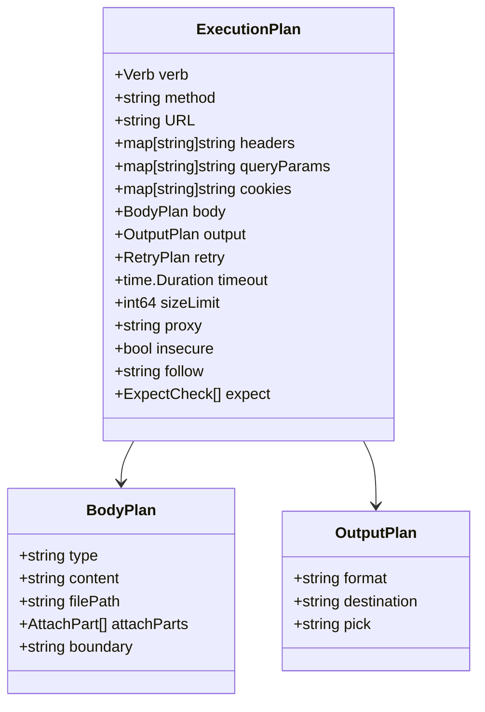

## Component Responsibilities

### Parser (`internal/parser`)

- **Tokenization**: Converts input string into tokens
- **Parsing**: Builds Abstract Syntax Tree (AST)
- **Validation**: Basic syntax validation
- **Error Reporting**: Provides position and suggestion information

### Planner (`internal/planner`)

- **Default Application**: Applies verb-specific defaults
- **Validation**: Validates method-verb compatibility
- **Plan Generation**: Creates execution plan from AST
- **Clause Processing**: Merges and processes all clauses

### Executor (`internal/runtime`)

- **Request Building**: Constructs HTTP request from plan
- **Session Management**: Applies and captures sessions
- **Redirect Handling**: Implements redirect policies
- **Response Processing**: Decompression, formatting, expectations
- **Error Handling**: Maps errors to exit codes

### Session Manager (`internal/session`)

- **Storage**: Manages session file storage
- **Security**: Enforces file permissions
- **Retrieval**: Loads sessions for auto-application
- **Updates**: Captures and stores session data

## File Structure

```
req/
├── cmd/req/          # Main entry point
├── internal/
│   ├── parser/      # Command parsing
│   ├── planner/     # Execution planning
│   ├── runtime/     # Request execution
│   ├── session/     # Session management
│   ├── types/       # Type definitions
│   └── grammar/     # Grammar definitions
├── tests/           # Test suite
└── docs/            # Documentation
```

## See Also

- [Grammar Reference](GRAMMAR.md) - Grammar specification
- [Error Handling](ERRORS.md) - Error flow details
- [Session Management](SESSIONS.md) - Session architecture
- [Contributing](CONTRIBUTING.md) - Development guide

